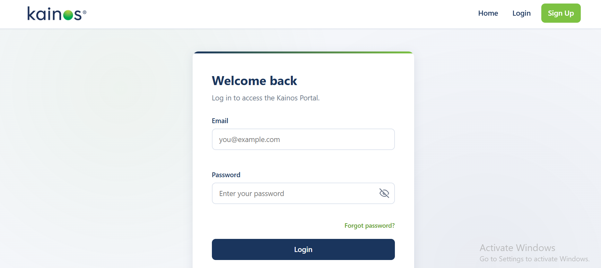
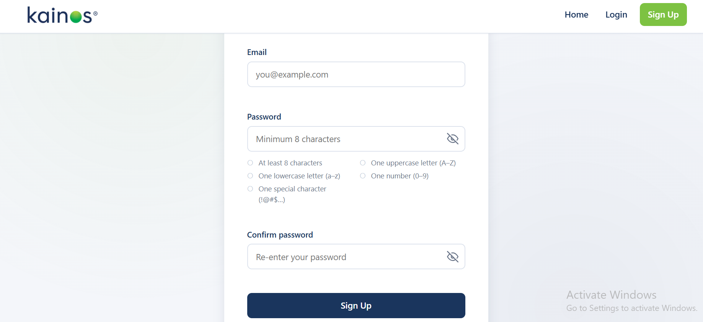
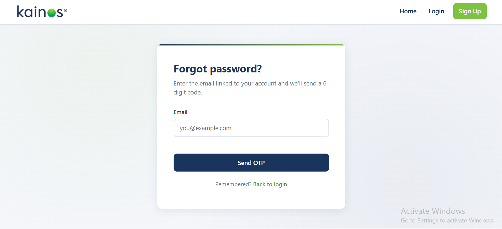
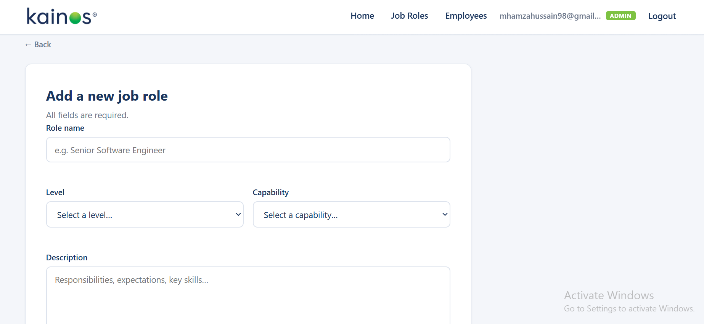
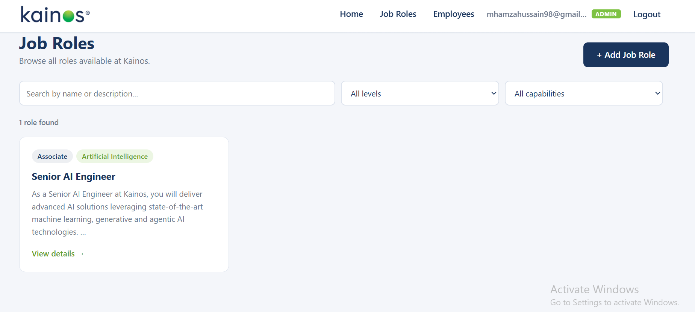
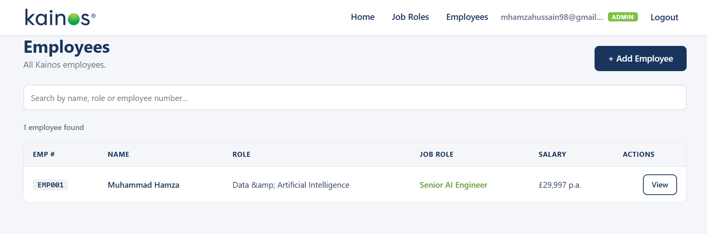

# Kainos Portal

A full-stack Job Roles & Employee Management Portal built with **React + Vite** (frontend) and **Node.js + Express** (backend). Features secure authentication with OTP-based password reset, role-based access control, and full CRUD for job roles and employees.

---

## Screenshots

### Login


### Register


### Forgot Password — OTP Email


### Job Roles List


### Job Role Detail


### Employee List (Admin)


---

## Features

### Authentication
- Register with email + strong password
- Login with JWT (httpOnly cookie)
- Forgot password via 6-digit OTP email (Resend)
- OTP expiry (10 min), max 5 attempts, bcrypt-hashed storage
- Reset password with secure token (15 min expiry)
- Live email uniqueness check (debounced)
- Password strength meter + requirements checklist

### Job Roles
- Browse, search and filter by level and capability
- View full job role details
- Admin: create, edit, delete job roles
- Duplicate detection (name + level + capability)

### Employees (Admin only)
- Full employee CRUD
- Auto-generated employee numbers (EMP001, EMP002…)
- UK postcode validation
- Linked to job roles

### Security
- JWT authentication (httpOnly cookies)
- bcrypt password hashing (12 rounds)
- Rate limiting on all auth endpoints
- Security headers (X-Frame-Options, X-XSS-Protection, etc.)
- Input sanitization (HTML escape on all text fields)
- Prototype pollution protection
- CORS restricted to frontend URL

### UI / UX
- Fully responsive (mobile 360px → desktop 1200px)
- Slide-in mobile navigation with overlay + Escape key close
- 44px touch targets (WCAG)
- Accessible: `aria-invalid`, `aria-label`, focus-visible
- Debounced search with request cancellation
- Gzip compression on API responses

---

## Tech Stack

| Layer | Technology |
|---|---|
| Frontend | React 18, Vite, React Router v6, Axios |
| Backend | Node.js, Express 4 |
| Database | JSON file store (no external DB required) |
| Auth | JWT, bcrypt, httpOnly cookies |
| Email | Resend (OTP delivery) |
| Validation | express-validator (backend), custom (frontend) |

---

## Project Structure

```
kainos-portal/
├── backend/
│   ├── config/          # DB initialisation
│   ├── controllers/     # Auth, job roles, employees
│   ├── data/            # JSON file store (auto-created)
│   ├── middleware/       # JWT auth + express-validator
│   ├── routes/          # Express routers
│   ├── utils/           # jsonDb, sendEmail, ensureAdmin
│   ├── .env.example
│   └── server.js
│
├── frontend/
│   ├── src/
│   │   ├── components/  # Header, Footer, PasswordInput, OtpInput
│   │   ├── pages/       # All page components
│   │   ├── styles/      # CSS per page/component
│   │   └── utils/       # AuthContext, api.js, validators.js
│   └── vite.config.js
│
├── screenshots/         # Add your screenshots here
└── README.md
```

---

## Getting Started

### Prerequisites
- Node.js 18+
- A free [Resend](https://resend.com) account with a verified domain

---

### 1. Clone the repository

```bash
git clone https://github.com/YOUR_USERNAME/kainos-portal.git
cd kainos-portal
```

### 2. Backend setup

```bash
cd backend
npm install
cp .env.example .env
```

Edit `.env` with your values:

```env
PORT=5000
JWT_SECRET=your_long_random_secret_here
JWT_EXPIRES_IN=7d

RESEND_API_KEY=re_xxxxxxxxxxxxxxxx
EMAIL_FROM=Kainos Portal <noreply@yourdomain.com>

CLIENT_URL=http://localhost:5173
ADMIN_EMAIL=admin@yourdomain.com
ADMIN_PASSWORD=YourStrongPass1!
ADMIN_NAME=Admin Name
```

> **Email:** You must verify a domain at [resend.com/domains](https://resend.com/domains) to send OTPs to any email address.

Start the backend:

```bash
npm run dev
```

API runs at `http://localhost:5000`

---

### 3. Frontend setup

```bash
cd ../frontend
npm install
npm run dev
```

App runs at `http://localhost:5173`

---

## API Endpoints

### Auth
| Method | Route | Auth | Description |
|---|---|---|---|
| POST | `/api/auth/register` | No | Create account |
| POST | `/api/auth/login` | No | Login + set cookie |
| POST | `/api/auth/logout` | No | Clear cookie |
| GET | `/api/auth/me` | Yes | Current user |
| POST | `/api/auth/check-email` | No | Live email check |
| POST | `/api/auth/forgot-password` | No | Send OTP email |
| POST | `/api/auth/verify-otp` | No | Verify OTP |
| POST | `/api/auth/reset-password` | No | Reset password |

### Job Roles
| Method | Route | Auth | Admin | Description |
|---|---|---|---|---|
| GET | `/api/job-roles` | Yes | No | List with search/filter |
| GET | `/api/job-roles/meta` | Yes | No | Levels & capabilities |
| GET | `/api/job-roles/:id` | Yes | No | Single role |
| POST | `/api/job-roles` | Yes | Yes | Create |
| PUT | `/api/job-roles/:id` | Yes | Yes | Update |
| DELETE | `/api/job-roles/:id` | Yes | Yes | Delete |

### Employees
| Method | Route | Auth | Admin | Description |
|---|---|---|---|---|
| GET | `/api/employees` | Yes | Yes | List |
| GET | `/api/employees/:id` | Yes | Yes | Single |
| POST | `/api/employees` | Yes | Yes | Create |
| PUT | `/api/employees/:id` | Yes | Yes | Update |
| DELETE | `/api/employees/:id` | Yes | Yes | Delete |

---

## Default Admin Account

On first start, the backend auto-creates an admin user using the values in `.env`:

```
ADMIN_EMAIL=your_admin_email
ADMIN_PASSWORD=your_admin_password
```

---

## Validation Rules

| Field | Rules |
|---|---|
| Email | Required, valid format, unique, max 254 chars |
| Password | Min 8 chars, uppercase, lowercase, number, special char, max 128 |
| Name | 2–100 chars, letters/spaces/hyphens/apostrophes |
| UK Postcode | Format: `AA9 9AA` |
| Salary | £0 – £10,000,000 |
| Description | 10–2000 chars |
| OTP | Exactly 6 digits |

---

## Environment Variables

| Variable | Description |
|---|---|
| `PORT` | Backend port (default: 5000) |
| `JWT_SECRET` | Secret for signing JWT tokens |
| `JWT_EXPIRES_IN` | Token expiry (e.g. `7d`) |
| `RESEND_API_KEY` | Resend API key |
| `EMAIL_FROM` | Sender address (must use verified domain) |
| `CLIENT_URL` | Frontend URL for CORS |
| `ADMIN_EMAIL` | Auto-created admin email |
| `ADMIN_PASSWORD` | Auto-created admin password |
| `ADMIN_NAME` | Auto-created admin display name |
